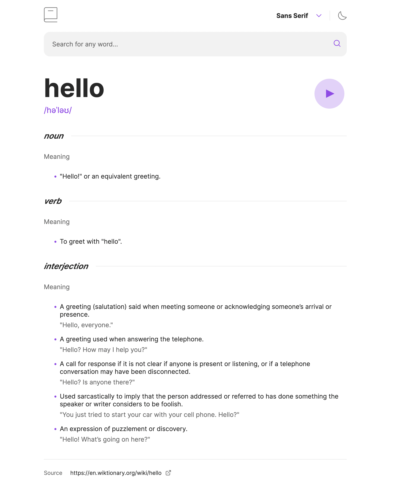
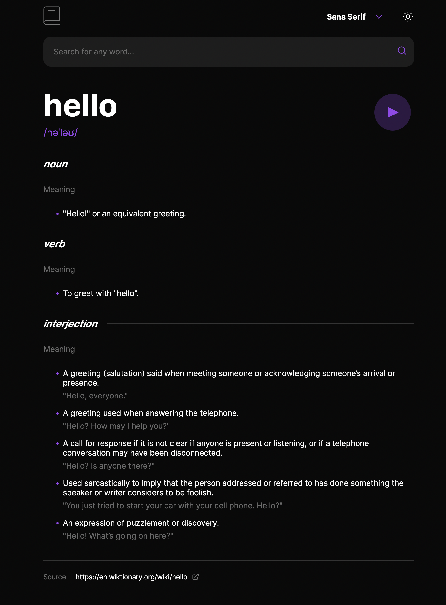

# Dictionary web app




[Live Site URL](https://github.com/chonhenry/angular-dictionary)

## Table of contents

- [Overview](#overview)
  - [The challenge](#the-challenge)
  - [Local Development](#local-development)
- [My process](#my-process)
  - [Built with](#built-with)
  - [What I learned](#what-i-learned)
- [Author](#author)

**Note: Delete this note and update the table of contents based on what sections you keep.**

## Overview

### The challenge

Users should be able to:

- Search for words using the input field
- See the [Free Dictionary API's](https://dictionaryapi.dev/) response for the searched word
- Play the audio file for a word when it's available
- Switch between serif, sans serif, and monospace fonts
- Switch between light and dark themes
- View the optimal layout for the interface depending on their device's screen size

### Local Development

Clone down this repository. You will need [`angular-cli`](https://angular.io/cli) and `npm` installed globally on your machine.

Installation:
`npm install`

To Start Server:
`ng serve`

To Visit App:
`localhost:4200`

## My process

### Built with

- HTML5
- CSS
- Typescript
- [Angular](https://angular.io/) - JS framework

### What I learned

I learned how to implement light/dark theme feature in Angular.
First I added the `data-theme="light"` attribute to the `<body>` element in the `index.html`.

```html
<body data-theme="light">
  <app-root></app-root>
</body>
```

Then I configured the colors for both light and dark theme in the `_theme.css` file and import it in `styles.css`.

```css
[data-theme="light"] {
  --background-color: #ffffff;
  --primary-color: #2d2d2d;
  --secondary-color: #757575;
  --tertiary-color: #f4f4f4;
  --quaternary-color: #e9e9e9;
}

[data-theme="dark"] {
  --background-color: #050505;
  --primary-color: #ffffff;
  --secondary-color: #757575;
  --tertiary-color: #1f1f1f;
  --quaternary-color: #3a3a3a;
}
```

```css
@import "_themes.css";

body {
  background-color: var(--background-color);
  color: var(--primary-color);
}
```

In `navbar.component.ts`, I initialized the `isLightTheme` varibale and added the `onThemeSwitchChange()` function, which will be triggered every time the theme switcher is toggled.

```js
public isLightTheme = true;
onThemeSwitchChange() {
  this.isLightTheme = !this.isLightTheme;
  document.body.setAttribute(
      'data-theme',
      this.isLightTheme ? 'light' : 'dark'
  );
}
```

Now I just have to add this function to the theme toggle icon in `navbar.component.html` so when the icon is clicked, the theme will be toggled.

```html
<div class="switch-theme">
  
  
</div>
```

## Author

- [My Website](https://www.henrychon.com/)
- [My Github](https://github.com/chonhenry)
- [My Linkedin](https://www.linkedin.com/in/chonhenry/)
